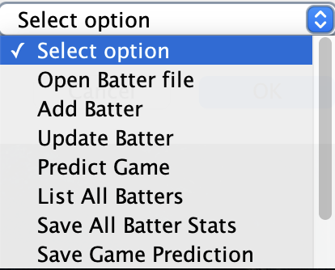
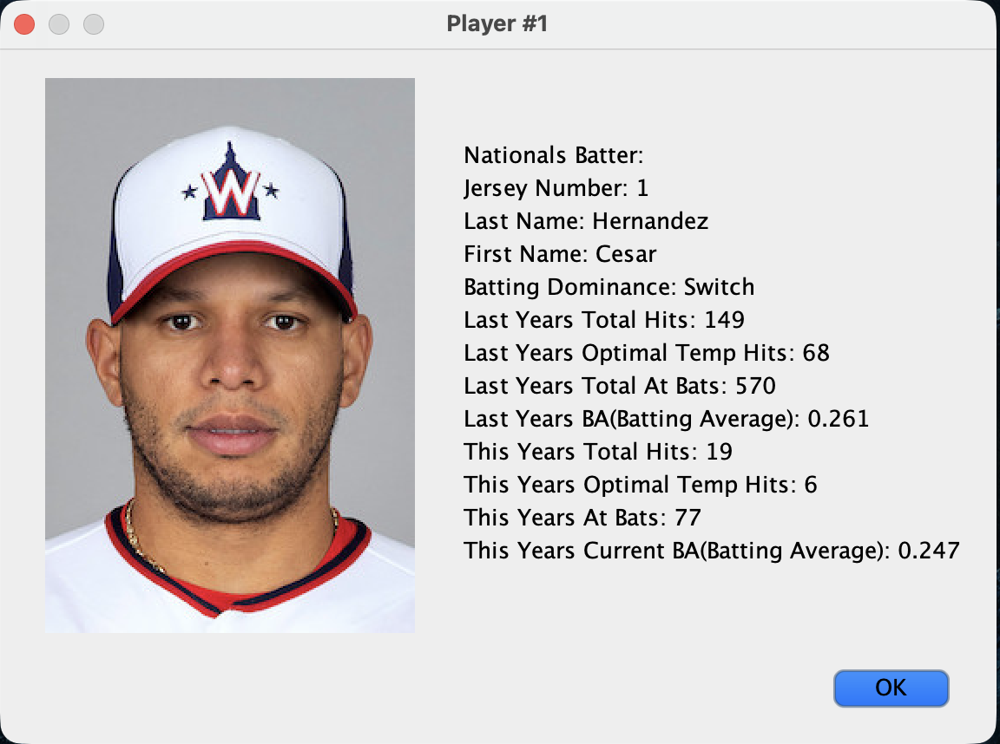
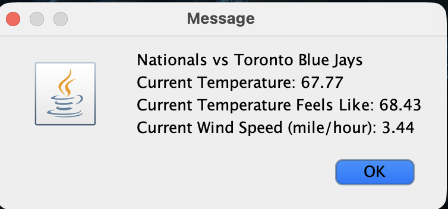

# Bayesian Baseball Predictor

A Java application that combines statistical methods, MLB player statistics, and real world weather data estimate a player's batting performance under certain game conditions (temperature).

## Photos

### Main Menu

### Player Data

### Weather Data

## Overview

I built this application to explore how weather conditions relate to baseball performance. The prototype only uses temperature, but this program can be expanded to use other weather attributes.

The application maintains Washington Nationals batter statistics, retrieves current weather conditions located near the MLB stadiums using OpenWeather API, analyzes historical temperature data, and uses a bayes-inspired statistical calculation to estimate a predicted batting average for the selected player and game.

The project also included Excel-based data persistence, player management, input validation, and a Java Swing dialog-based user interface.

## Features

1. Store and manage player information and statistics
2. Load existing player data from Excel files
3. Add new batter's to the database
4. Update existing player's
5. Search for individual players
6. OpenWeather API to retrieve current weather data
7. Match MLB teams with their stadium
8. Analyze historical game-temperature data
9. Generate weather-based batting average predictions
10. Save updates to Excel
11. Save game predictions for future observations
12. Validate user input
13. Display player and prediction information through a Java Swing interface

## How I generate predictions

The model inspiration was based on Bayes' Theorem:

'P(A|B) = (P(B|A) * P(A)) / P(B)' -> 'Predicted Batting Performance = (P(Temperature|Hit) * P(Hit)) / P(Temperature)' 

The application first determines the current game temperature using weather data from OpenWeather API.
Historical game data is then grouped into temperature ranges:
- 55°F and below
- 56-65°F
- 66-75°F
- 76-85°F
- 86-95°F
- 96-105°F

Temperatures outside the available data do not produce a prediction. 

> This model represents a exploratory statistical predictor and is not intended to represent a industry-polished forecasting model.
Note: Future iterations could make this a ML model by training the model on years of historical data for each batter.

## Project Architecture

### 'StatsForWeather'

Acts as the main application.
Controls all user interface functions.

### 'Batter'

Basic characteristics of a baseball player, which includes:

- Jersey number
- First name
- Last name
- Batting side
- Player image

### 'BatterwStats'

Extends 'Batter' and adds statistics, which includes:

- Previous-season hits
- Previous-season at-bats
- Previous-season optimal-temperature hits
- Current-season hits
- Current-season at-bats
- Current-season optimal-temperature hits
- Batting averages

### 'NationalsPlayer'

Information associated with game prediction, which includes:

- Player
- Opposing team
- Game number
- Game temperature
- Predicted batting average

### 'WeatherAPI'

Handles retrieval of weather data from OpenWeather API.

Responsibilities include:

- Sending API requests
- Parsing JSON responses using Gson
- Mapping MLB teams to city ID's

### 'ExcelInputOutput'

Handles Excel file operations using Apache POI.

Responsibilities include:

- Loading player statistics
- Reading historical temperature data
- Saving player statistics
- Saving game predictions

### 'Statistics'

- Bayes' Theorem calculation which separates the mathematical logic from main class

### 'JOptionVCheck'

Provided I/O validation.

## Technologies

- Java
- Java Swing / JOptionPane
- API: OpenWeather API
- Gson
- Apache POI
- Microsoft Excel
- Git
- GitHub

## Setup

1. Clone

2. Create a '.env' file with a API key: Text: OPENWEATHER_API_KEY="YOUR_API_KEY"

3. Load the environment variables: set 

-a
source .env
set +a

4. Compile and run: 

CP=$(find lib -name "*.jar" -print | paste -sd: -)
javac -cp "$CP" -d bin src/statPre/*.java
java -cp "bin:$CP" statPre.StatsForWeather

